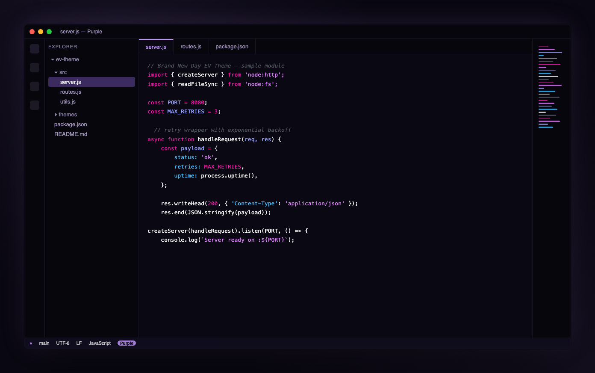
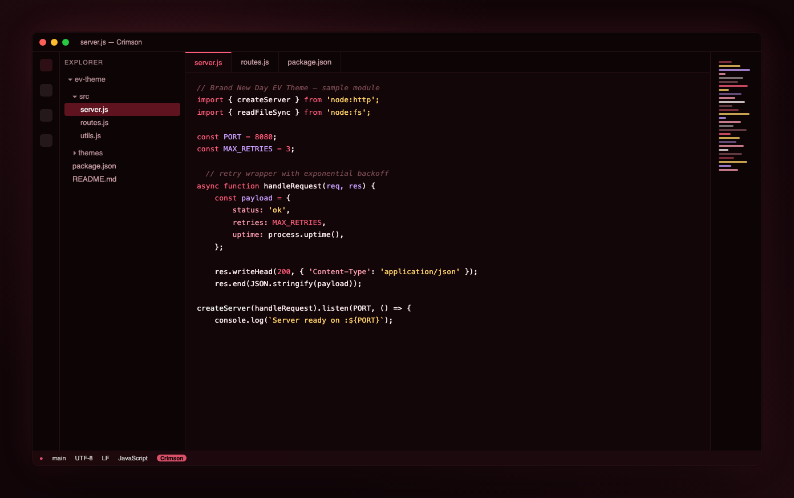
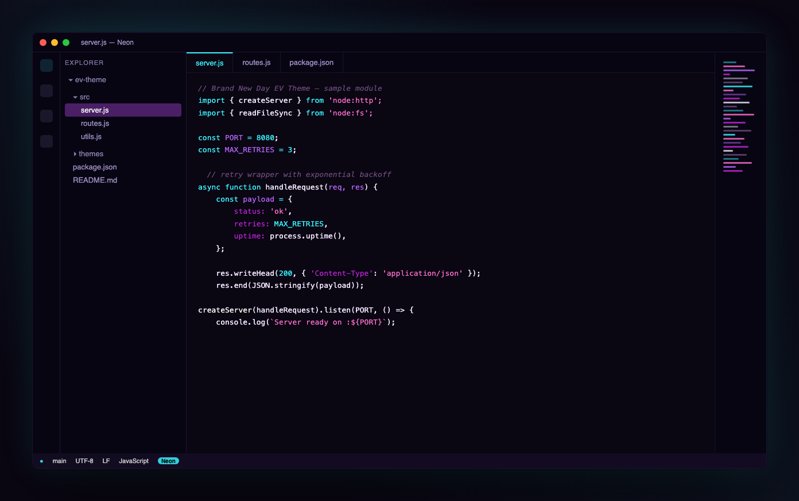
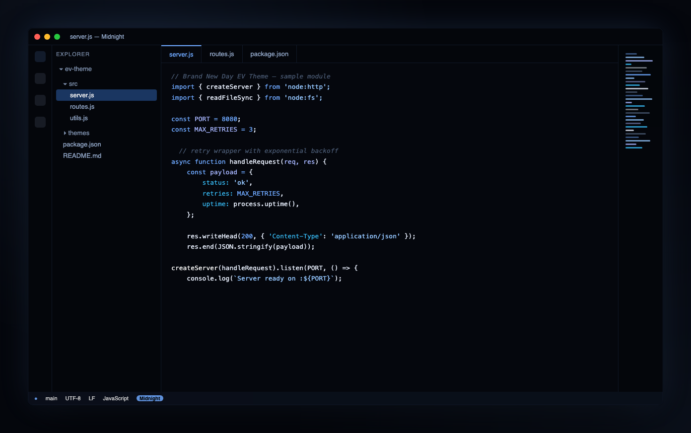
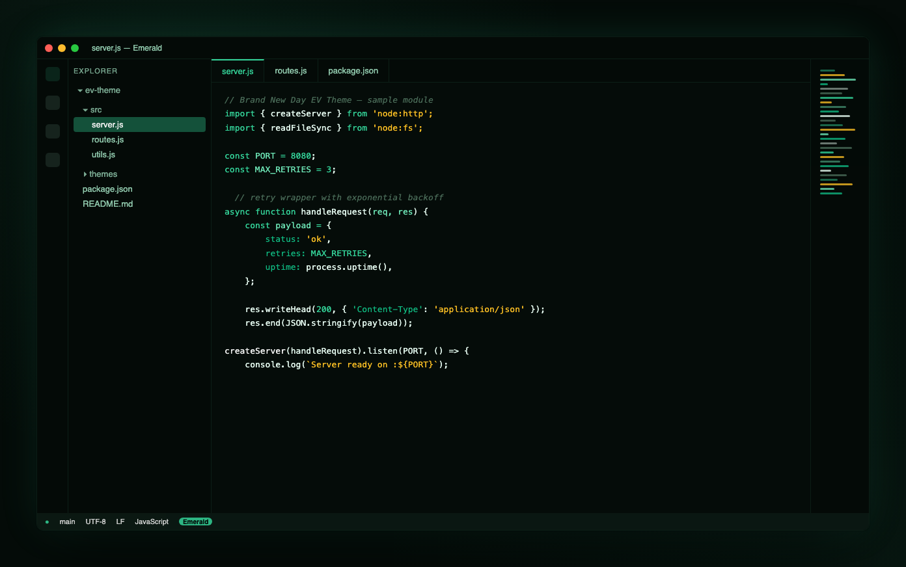
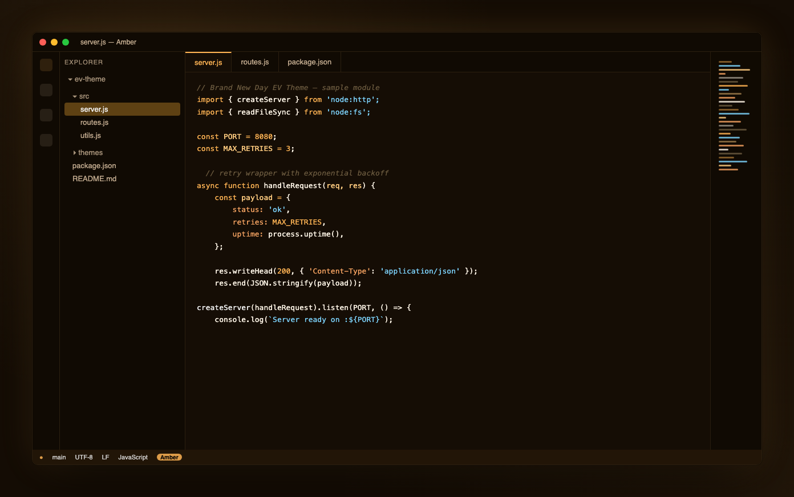

A family of dark color themes for VS Code — custom UI palettes paired with vibrant,
glowing syntax highlighting. Six variants, one extension.

## Variants

| Variant | Palette |
|---|---|
| **Purple** (default) | Deep purple, glowing lilac accents |
| **Crimson** | Black with deep red accents |
| **Neon** | Synthwave — cyan and magenta on near-black |
| **Midnight** | Deep blue-black with soft blue accents |
| **Emerald** | Near-black with emerald green accents |
| **Amber** | Near-black with warm orange/gold accents |

Switch between them anytime via `Cmd+Shift+P` / `Ctrl+Shift+P` → **Preferences: Color Theme**.

## Screenshots

| | |
|---|---|
| **Purple**  | **Crimson**  |
| **Neon**  | **Midnight**  |
| **Emerald**  | **Amber**  |

## Installation

### Via Marketplace

Search for **"Brand New Day EV Theme"** in the Extensions view (`Cmd+Shift+X` / `Ctrl+Shift+X`),
or run:

```
ext install ryanditko.brand-new-day-ev-theme
```

### Via `.vsix` file (manual)

1. Download the latest `.vsix` from [Releases](https://github.com/Ryanditko/ev-theme/releases).
2. In VS Code: `Cmd+Shift+P` / `Ctrl+Shift+P` → `Extensions: Install from VSIX...`
3. Select the downloaded file.
4. `Cmd+Shift+P` → `Preferences: Color Theme` → pick the variant you want.

## Development

```bash
npm install -g @vscode/vsce
vsce package
```

This generates the `.vsix` file in the project root. Each variant lives in its own file under
`themes/`, all registered in `package.json` under `contributes.themes`.

## Credits

- This extension's syntax highlighting rules (`tokenColors`), shared across all variants, were
  originally derived from the open-source [1984](https://github.com/juanmnl/vs-1984) theme,
  © juanmnl, licensed under MIT (see `LICENSE` for the full copyright notice).
- UI palettes and packaging by Ryanditko.
